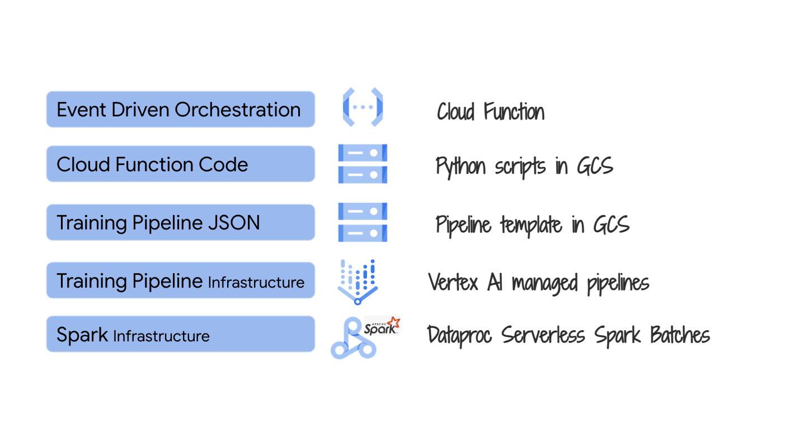

# About

In this module we will create a Cloud Function that executes a Vertex AI pipeline on-demand based off of a pipeline JSON in GCS. This module takes 15 minutes to review, and almost an hour to run.

## 1. Where we are in the model training lifecycle

   

## 2. The lab environment

   

## 3. The exercise

   

## 3. The pipeline JSON

## 4. Documentation for scheduling Vertex AI pipelines

## 5. Review of the Cloud Function for executing the Vertex AI Spark ML Model Training Pipeline

## 6. Execute the Cloud Function and monitor for pipeline execution through completion

