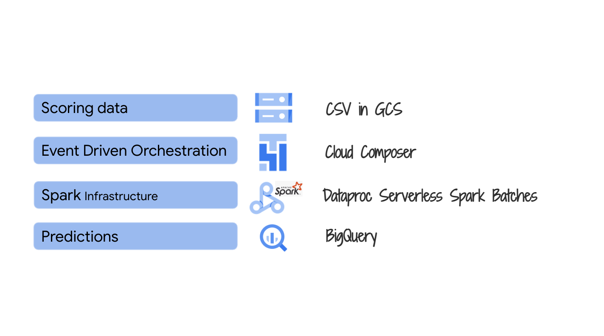

# About

This module covers orchestrating Spark ML batch scoring with Apache Airflow on Cloud Composer. Vertex AI pipelines has deliberately not been used as it lacks support for model monitoring and explainability and is not suited for upstream job orchestration typical with batch scoring and that may not be ML related.

## 1. Where we are in the SparK ML model lifecycle

   
  

## 2. The lab environment

   
  

## 3. The exercise

   
  

## 4. Review of the Cloud Composer Environment setup

Module 1 created and configured your Cloud Composer environment, including Airflow variables import and upload of the precreated Apache Airflow DAG into the Cloud Composer DAG bucket. In this section, we will walkthrough the author's environment.

### 4a. Cloud Composer environment

   
  

   
  

### 4b. Cloud Composer - Airflow variables

   
  

   
  

### 4c. Cloud Composer - Airflow DAG

   
  

   
  

### 4d. Cloud Composer - Airflow GUI

   
  

   
  

